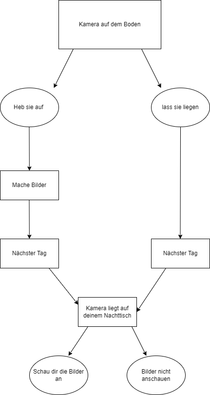

<!-- [Diagramm](./VN.png)

 -->

<h1>Story zum Diagramm:</h1>
Eines Tages ging Frederick auf die Party seines Kumpels Jonas. Die Party ging bis tief in die Nacht hinein. Früh am Morgen, als alle Gäset genagen sind und nur noch er geblieben ist, haute er sich in dem Gästezimmer seines Kumpels ins Bett. Im Gästezimmer seines Kumpels lag eine alte Kamera auf dem Boden.
 
<ol>
    <li> Wem gehört die Kamera hier? Frägt er seinen Kumpel. Dieser antwortet aber nicht. Er ging schlafen. Am nächsten Morgen wachte er auf, und sah plötzlich die Kamera auf dem Nachtisch neben seinem Bett. War jemand in seinem Zimmer gewesen? Er hatte nichts bemerkt als er geschlafen hatte. Die Tür war auch immernoch zu und es sah sonst auch so aus als ob niemand dagewesen wäre.</li>
    <li>Er hebt die Kamera auf und macht ein paar Bilder von paar Bilder aus dem Zimmerfenster heraus und Selfies. Anschließend legt er die Kameras auf den Nachtisch und schläft ein. Am nächsten morgen liegt die alte kamera immernoch neben sich auf dem Nachttisch</li>
</ol>
 
<ol>
<li>Er schaut sich die Bilder an und sieht dabei Bilder von der Party am Vorabend und teilweise verschwommene Gesichter. If(before 1) er sieht seine bilder auch noch. Nachdem er sie wieder hingelegt hat steht er auf und geht in die Küche.</li>
<li>Er steht auf und geht in die Küche</li>
</ol>
Dort findet er Jonas tod auf dem Boden.
